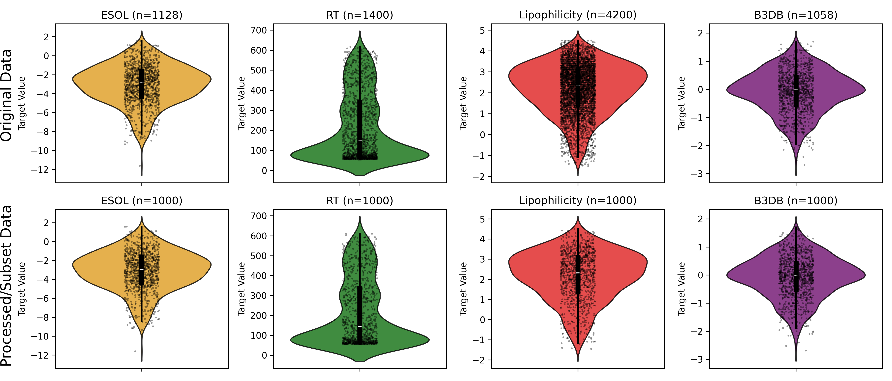
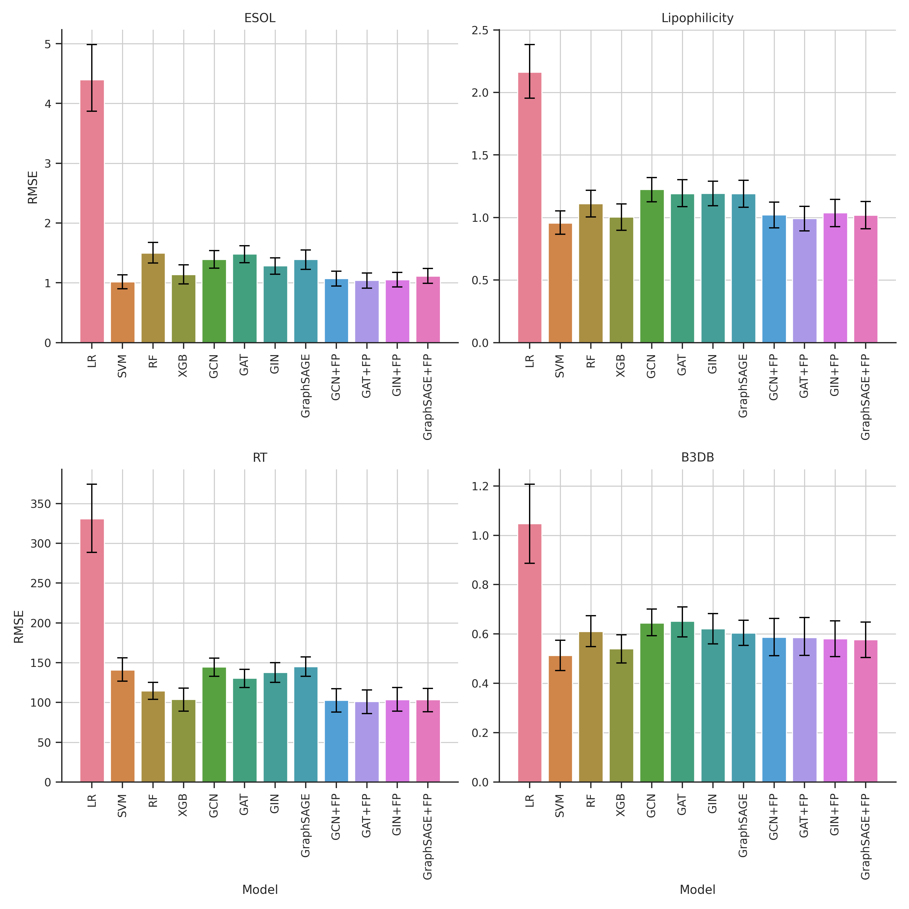

# Benchmarking Graph Neural Networks for Molecular Property Prediction

## Datasets
- [ESOL](https://moleculenet.org/datasets-1): A MoleculeNet solubility dataset containing experimental aqueous solubility values for small molecules.
- [Lipophilicity](https://moleculenet.org/datasets-1): A MoleculeNet dataset providing experimental lipophilicity (LogD) measurements for drug-like compounds.
- [B3DB](https://github.com/theochem/B3DB): A curated and diverse molecular database of blood–brain barrier permeability annotated with chemical descriptors.
- [RT](https://github.com/Qiong-Yang/GNN-TL): Retention-time data sourced from the GNN-TL repository for modeling chromatographic behavior of molecules.

## Methodology

This study investigates the performance gap between traditional expert-crafted descriptors (ECFP4) and modern graph-based representations for smaller datasets (approx. 1000 molecules).

### Step 1: Data Acquisition and Standardization
Four datasets (ESOL, Lipophilicity, B3DB, and RT), were obtained from MoleculeNet and related published studies. The SMILES strings were preprocessed and subsetted to 1000 SMILES per dataset.
* **Standardization Pipeline:** Using **RDKit**, all SMILES strings undergo:
    1.  Tautomer standardization.
    2.  Neutralization of charged species.
    3.  Removal of counterions and salts.
* **Downsampling Protocol:** For each dataset, **1000 molecules** were randomly sampled to create a "Small-Data" benchmark. Reproducibility is ensured by fixing random seeds for all subsampling procedures.

### Step 2: Representation Engineering
Two distinct input streams were generated to compare "expert priors" vs "learned topology".

* **Classical Stream:** 1024-bit **Extended-Connectivity Fingerprints (ECFP4)** with a radius of 2, generated via RDKit.
* **GNN Stream:** Molecules are featurized as graphs $G = (V, E)$. 
    * **Node Features ($h_v$):** Include atom type, degree, formal charge, aromaticity, and hybridization state.

### Step 3: Optimized Classical ML Baseline
Classical machine-learning models, including Linear Regression, SVM, Random Forest, and XGBoost, were first implemented as baseline methods to enable a fair worst-case comparison with the GNNs.

* **Model Selection and Hyperparameter Tuning:**: Hyperparameters for each model were optimized separately for each dataset, and the configuration yielding the lowest RMSE was used to train the final model on that dataset.

### Step 4: Simple GNN Implementation and Tuning
Shallow, single-layer versions of **GCN, GAT, GIN, and GraphSAGE** were implemented in `torch_geometric` to minimize complexity and isolate the inductive bias of each aggregator.

* **Architecture:** One message-passing layer followed by **Global Mean Pooling** (readout) and a 2-layer MLP regression head with single neuron as output.
* **Hyperparameter Tuning:** Hyperparameter tuning was performed for three parameters: hidden layer size, learning rate, and batch size.

### Step 5: Hierarchical Fusion Framework
To address **"Representational Overshadowing,"** where one feature set might dominate the gradients, a staged fusion approach was implemented rather than a "flat" concatenation.

* **Extraction:** The molecular graph is passed through the simple GNNs to generate a topological embedding ($Z_{gnn}$).
* **Fusion:** We concatenate $Z_{gnn}$ with the ECFP4 fingerprint *after* the GNN layer but *before* the final regression MLP.

## Results

